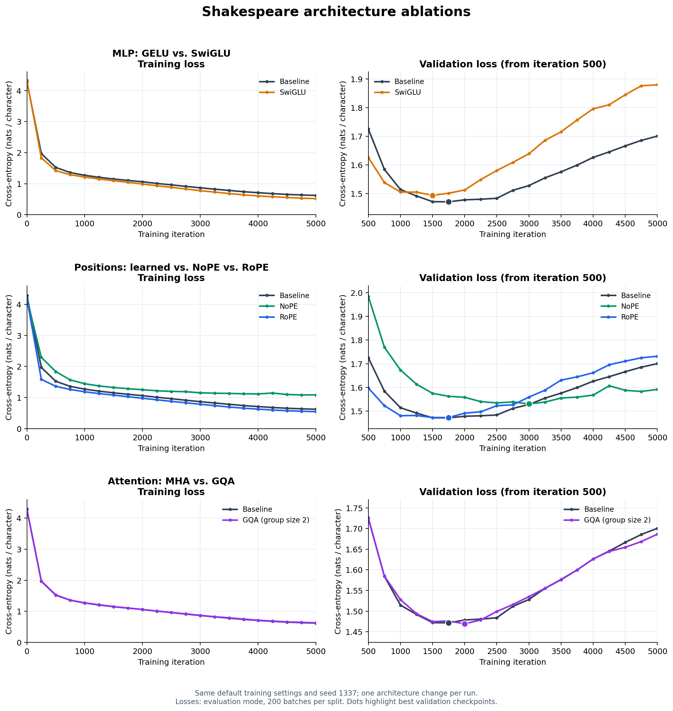

# MLP, positional encoding, and attention experiments

Each experiment changes one component of the original character-level Shakespeare
baseline. These variants retain **pre-LayerNorm**; they do not build on the earlier
RMSNorm run. Every model is trained from scratch through iteration 5,000.

## What the baseline uses

- **MLP:** `nn.GELU()` (the default exact GELU), between a `384 → 1536` projection
  and a `1536 → 384` projection, followed by dropout.
- **Positions:** a learned absolute positional embedding table with shape
  `256 × 384`. Its position vectors are added to token embeddings before the
  first Transformer block.
- **Attention:** multi-head attention with 6 query heads, 6 key heads, and
  6 value heads, each of dimension 64.

The implementation is in [`model.py`](../../../model.py); architecture options
are exposed by [`train.py`](../../../train.py) and stored in every checkpoint.
Defaults still reproduce the original model, and old checkpoints remain loadable.

## Implementation

### SwiGLU with matched parameters

The original bias-free GELU MLP has two weight matrices and `8d²` parameters.
SwiGLU has three matrices, so its intermediate width is `h = 8d/3`:

```text
GELU:    W_down GELU(W_up x)                    hidden width = 1536
SwiGLU:  W_down [SiLU(W_gate x) * (W_value x)]   hidden width = 1024
SiLU(z) = z * sigmoid(z)
```

At `d = 384`, both MLPs have **1,179,648 parameters per block**. Both full models
have **10,745,088 trainable parameters**, counting tied token/output weights once.
The gate and value projections are packed into one linear layer for efficiency.
Dropout placement and all other components are unchanged. The gated formulation
follows [GLU Variants Improve Transformer](https://arxiv.org/abs/2002.05202).

### NoPE and RoPE

**NoPE** removes the learned positional table and the addition of position vectors.
The causal attention mask remains, so the model still has a structural source of
ordering information; NoPE means no explicit positional encoding.

**RoPE** also removes the learned table. Within every attention layer, it rotates
adjacent feature pairs of **queries and keys**, before attention scores are
computed. Values are unchanged. All 64 dimensions of each head are rotated, using
`theta = 10000` and position indices `0…T−1`. The rotation frequency for pair `i`
is `theta^(−2i/64)`. Sine/cosine tables are fixed buffers, computed in float32 and
cast to the query/key dtype when applied. This follows
[RoFormer](https://arxiv.org/abs/2104.09864).

Both positional variants remove **98,304 learned parameters**, leaving
**10,646,784** in total. Context length remains 256; these runs do not measure
generalization to longer contexts.

### GQA with group size 2

GQA retains 6 query heads but projects only 3 key heads and 3 value heads.
Query heads `(0, 1)`, `(2, 3)`, and `(4, 5)` share the corresponding key/value
head. Head dimension remains 64; the attention output still has width 384.

The packed QKV projection changes from `384 → 1152` to `384 → 768`, while the
output projection remains `384 → 384`. This removes **884,736 parameters** across
six layers, leaving **9,860,352** in total, a reduction of about **8.23%**.

The implementation uses PyTorch's native `scaled_dot_product_attention` with
`enable_gqa=True`, consistent with the [GQA paper](https://arxiv.org/abs/2305.13245)
and [PyTorch's attention API](https://docs.pytorch.org/docs/2.11/generated/torch.nn.functional.scaled_dot_product_attention.html).
The explicit attention fallback repeats shared K/V heads. This repository does
not implement a decoding KV cache; the experiment does not establish a cache
memory or decoding-speed improvement.

## Controlled setup

- Original `config/train_shakespeare_char.py`: 6 layers, width 384, 6 query heads,
  context 256, batch size 64, dropout 0.2, no biases, gradient accumulation 1.
- AdamW, learning rate `1e-3 → 1e-4`, warmup 100, cosine decay through 5,000,
  weight decay 0.1, betas `(0.9, 0.99)`, gradient clipping 1.0.
- Seed 1337, RTX 4090, PyTorch `2.11.0+cu128`, CUDA bfloat16, `torch.compile=True`.
- Same dataset files and hashes: 1,003,854 training characters, 111,540 validation
  characters, vocabulary of 65 characters.
- Evaluation every 250 iterations, including iteration 0 and 5,000, using
  200 random batches per split with dropout disabled. Loss is cross-entropy in
  **nats per character**, and lower is better.
- The original nanoGPT loop performs updates numbered 0 through 5,000 inclusive.
  The evaluation labelled 5,000 occurs before its final update. This behavior is
  identical in the baseline and all variants. The saved checkpoint is the best
  validation checkpoint, not the final model.

The baseline is the previously completed run, with archived source and data
hashes. Tests verify that the extended model's default weights and outputs exactly
match that archived implementation. Each new run records its source snapshot,
configuration, dataset hashes, log, and best checkpoint.

## Results

All four training processes exited successfully, completed the 21 scheduled
evaluations, and produced verified checkpoints.

| Variant | Parameters | Best validation | Best iteration | Final training | Final validation |
|---|---:|---:|---:|---:|---:|
| Baseline | 10,745,088 | 1.4716 | 1,750 | 0.6217 | 1.7005 |
| SwiGLU | 10,745,088 | 1.4941 | 1,500 | 0.5190 | 1.8793 |
| NoPE | 10,646,784 | 1.5306 | 3,000 | 1.0837 | 1.5918 |
| RoPE | 10,646,784 | 1.4731 | 1,750 | 0.5449 | 1.7317 |
| GQA, group size 2 | 9,860,352 | 1.4692 | 2,000 | 0.6307 | 1.6863 |

These values come from the paired training-log evaluations, rounded to four
decimal places. Best-checkpoint full-precision values are retained in the metadata
and comparison JSON. Final losses are measured at iteration 5,000, not at the
best checkpoint.



The right panels zoom to iterations 500–5,000 to make the differences visible.
The CSV and individual run plots contain every evaluation, including 0 and 250.

### Additional evaluation on identical validation batches

Because architectures consume different numbers of random values during
initialization, the original training logs do not necessarily evaluate identical
windows. To check the comparison, every saved best checkpoint was also evaluated
on the **same 200 batches of 64 validation windows**, each of length 256. This
evaluates 3,276,800 character predictions per checkpoint, with window seed
20261004, dropout disabled, and eager CUDA bfloat16 execution for all models.

| Best checkpoint | Validation loss on identical windows | Change vs. baseline |
|---|---:|---:|
| Baseline | **1.471509** | — |
| SwiGLU | 1.499301 | +1.89% |
| NoPE | 1.535140 | +4.32% |
| RoPE | 1.477928 | +0.44% |
| GQA, group size 2 | 1.474026 | +0.17% |

The windows are sampled from the existing validation split and can overlap; this
is an additional comparison, not an independent test dataset. Per-batch losses,
sampling seed, window hash, and dataset hash are saved in
[`fixed_validation.json`](fixed_validation.json).

### Interpretation

**MLP:** SwiGLU fits the training data faster and ends with lower training loss,
but it generalizes worse under these unchanged hyperparameters. Its best logged
validation loss is 1.53% higher than baseline, and its shared-window loss is
1.89% higher. The widening train/validation gap and final validation loss of
1.8793 indicate stronger overfitting. Matching parameter count alone does not
guarantee an improvement; this experiment does not tune learning rate or dropout
specifically for SwiGLU.

**Positions:** NoPE learns more slowly and reaches a worse best validation loss
(1.5306 vs. 1.4716), although it has the lowest final validation loss at 5,000
because it overfits less over this training schedule. Selecting solely by the
last iteration would hide its weaker best checkpoint. RoPE learns faster early
in training and ends with lower training loss than baseline, but its best
validation quality is close to the learned-position model. The shared-window
evaluation is slightly worse, so these runs do not demonstrate a RoPE quality
gain at context length 256.

**GQA:** Sharing K/V heads reduces total parameters by 8.23% while retaining
similar validation quality. Its best logged loss is slightly lower than baseline
(1.4692 vs. 1.4716), but this small ranking reverses on identical validation
windows (1.474026 vs. 1.471509). The defensible conclusion from this run is
**similar quality with fewer parameters**, rather than a reliable improvement
in validation loss. Its final logged validation loss is also slightly lower
(1.6863 vs. 1.7005).

All runs overfit after their best validation checkpoint. The common-window
comparison favors the baseline, with RoPE and GQA close to it. Multiple training
seeds would be needed to establish whether those small differences are reliable.

### Saved artifacts

- [Combined PDF](loss_comparison.pdf), [raw loss CSV](loss_comparison.csv),
  [comparison JSON](comparison_summary.json), and [metrics table](metrics.md).
- MLP comparison: [PNG](mlp_comparison.png), [PDF](mlp_comparison.pdf).
- Positional comparison: [PNG](position_comparison.png), [PDF](position_comparison.pdf).
- Attention comparison: [PNG](gqa_comparison.png), [PDF](gqa_comparison.pdf).
- Individual runs: [baseline](../shakespeare_char_baseline_20261004/README.md),
  [SwiGLU](../shakespeare_char_swiglu_20261004/README.md),
  [NoPE](../shakespeare_char_nope_20261004/README.md),
  [RoPE](../shakespeare_char_rope_20261004/README.md),
  [GQA](../shakespeare_char_gqa2_20261004/README.md).

## Reproduce

From `nanoGPT-master`, run all missing experiments sequentially on the GPU:

```bash
python3 -u -B 'Mini-LLM Exercise/run_architecture_experiments.py'
```

Completed runs are skipped. To train fresh copies without overwriting the saved
results, pass `--run-tag repeat1`. Select one variant with, for example,
`--variants rope`. Each variant starts from scratch and uses the original default
training configuration, with only its architecture option and output path changed.

The corresponding architecture options for direct `train.py` commands are:

| Variant | Option |
|---|---|
| SwiGLU | `--mlp_type=swiglu` |
| NoPE | `--pos_encoding=nope` |
| RoPE | `--pos_encoding=rope` |
| GQA, group size 2 | `--kv_group_size=2` |

Use a distinct `--out_dir` under `Mini-LLM Exercise` for each direct run. Retain
`--norm_type=layernorm` for these independent comparisons. Exact commands are in
each run's `run_metadata.json`.

To regenerate plots, metrics, and per-run summaries:

```bash
python3 -B 'Mini-LLM Exercise/compare_architectures.py'
```

For fresh tagged runs, also pass `--run-tag repeat1` to the comparison script.
Both scripts locate project files relative to their own paths and work from any
current directory, including VS Code's **Run Python File**.

To repeat the additional comparison on identical validation windows, run this
after training completes, then regenerate the comparison summary:

```bash
python3 -B 'Mini-LLM Exercise/evaluate_architecture_checkpoints.py'
python3 -B 'Mini-LLM Exercise/compare_architectures.py'
```

The evaluation script requires GPU access and accepts the same `--run-tag` option.

## Verification and limits

The 15 automated checks cover baseline compatibility, RMSNorm compatibility,
matched SwiGLU parameters and gate computation, removal of positional weights,
RoPE norm preservation and relative-position dot products, RoPE attention against
an independent complex-number reference, GQA outputs and gradients against MHA
with tied key/value heads, causality, finite gradients, checkpoint round trips,
context cropping, generation, and invalid configurations.

```bash
python3 -B -m unittest discover -s 'Mini-LLM Exercise' -p 'test_*.py' -v
```

These are **single-seed results**. The architecture changes alter random-number
consumption during initialization, so equal seed settings do not guarantee
identical initial weights or minibatch draws across variants. Small differences
should not be interpreted as statistically established gains. No test split or
multi-seed confidence interval is available. Any iteration times in the JSON
summary come from training logs and are approximate, not a controlled speed
benchmark.
