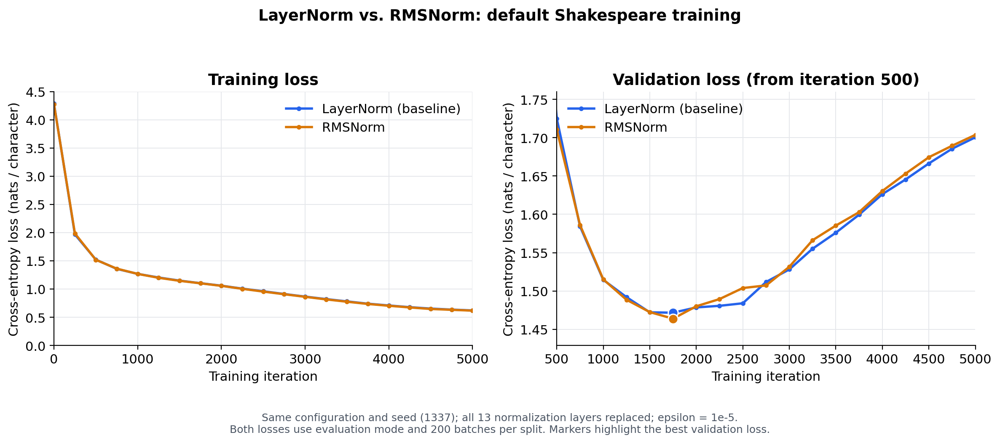

# Effect of normalization: LayerNorm versus RMSNorm

## Pre-LayerNorm or post-LayerNorm?

The baseline is **pre-LayerNorm**. In `Block.forward`, each sublayer receives a
normalized input before its output is added to the residual stream:

```python
x = x + self.attn(self.ln_1(x))
x = x + self.mlp(self.ln_2(x))
```

A post-LayerNorm block would normalize after the residual addition, for example
`x = norm(x + attention(x))`. The model also has a final normalization after all
Transformer blocks and before the vocabulary projection; this does not change the
blocks' pre-norm placement. See [the model implementation](../../../model.py).

## RMSNorm change and controlled setup

All 13 normalization layers were replaced: two in each of the six blocks, plus the
final normalization. Placement remains pre-norm. The implementation selects
`torch.nn.RMSNorm(n_embd, eps=1e-5)` through `--norm_type=rmsnorm`.

For a hidden vector x, the normalizations are:

- LayerNorm: `gamma * (x - mean(x)) / sqrt(mean((x - mean(x))**2) + epsilon)`.
- RMSNorm: `gamma * x / sqrt(mean(x**2) + epsilon)`.

RMSNorm omits mean subtraction and retains a learned scale. The baseline uses
`bias=False`, so neither variant has an additive normalization bias. Epsilon is
explicitly matched at `1e-5` in both variants. This follows the
[RMSNorm definition](https://arxiv.org/abs/1910.07467) and
[PyTorch RMSNorm implementation](https://docs.pytorch.org/docs/2.11/generated/torch.nn.RMSNorm.html).

Both runs start from scratch with seed 1337 and the default
`config/train_shakespeare_char.py`: 6 layers, 6 heads, embedding dimension 384,
context length 256, batch size 64, dropout 0.2, and the same AdamW settings and
learning-rate schedule. Both have 10,745,088 trainable parameters, including
position embeddings. They use identical dataset files, CUDA bfloat16,
`compile=True`, and the same RTX 4090 / PyTorch 2.11.0+cu128 environment.

The original LayerNorm run was reused after verifying its source and dataset hashes.
The new selectable LayerNorm implementation reproduces the archived implementation
exactly in the regression check, and the LayerNorm/RMSNorm initial parameters match.
Only normalization type and output directory differ between training configurations.

Both runs completed through logged iteration 5,000 (`max_iters=5000`, including the
stock loop's iteration zero). Training and validation evaluation losses were
measured every 250 iterations, averaged over 200 batches per split with dropout
disabled. Each curve contains 21 evaluations; all reported losses are in nats per
character and rounded to four decimal places by the training log.

## Results

| Metric | LayerNorm baseline | RMSNorm |
|---|---:|---:|
| Best validation loss | 1.4716 | 1.4638 |
| Iteration of best validation | 1,750 | 1,750 |
| Training loss at best validation | 1.1045 | 1.1024 |
| Final training loss (iteration 5,000) | 0.6217 | 0.6182 |
| Final validation loss (iteration 5,000) | 1.7005 | 1.7037 |
| Best validation perplexity, exp(loss) | 4.3562 | 4.3224 |
| Median logged training iteration time | 13.87 ms | 13.77 ms |

Timing values are medians of 432 logged iterations per run, starting at
iteration 500 and excluding evaluation iterations. They are approximate training-log
timings and are insufficient to establish a meaningful speed advantage.



The training curves nearly overlap. RMSNorm achieves a best validation loss lower by
**0.0078 nats/character (0.53%)** at the same best iteration, 1,750.
At iteration 5,000, RMSNorm has a slightly lower training loss but a slightly higher
validation loss. Both models overfit after their validation minimum: training loss
continues decreasing while validation loss rises. The best checkpoints therefore
provide a better comparison of generalization than the final models.

This single-seed experiment suggests similar overall behavior with a small best-loss
improvement for RMSNorm. It does not establish a consistent advantage across seeds.

## Reproduce

From `nanoGPT-master`, the RMSNorm training command used was:

```bash
set -o pipefail
python3 -u -B train.py config/train_shakespeare_char.py --norm_type=rmsnorm '--out_dir=Mini-LLM Exercise/results/shakespeare_char_rmsnorm_20261004/checkpoint' 2>&1 | tee 'Mini-LLM Exercise/results/shakespeare_char_rmsnorm_20261004/train.log'
```

Regenerate the comparison without retraining:

```bash
python3 -B 'Mini-LLM Exercise/compare_normalization.py'
```

This comparison script also works with VS Code's **Run Python File** button, using
the two saved runs by default. Regenerate the RMSNorm-only plot with:

```bash
python3 -B 'Mini-LLM Exercise/plot_training_loss.py' 'Mini-LLM Exercise/results/shakespeare_char_rmsnorm_20261004/train.log'
```

Run the normalization checks with:

```bash
python3 -B 'Mini-LLM Exercise/test_normalization.py'
```

Six tests passed: baseline output preservation, matching initial weights and parameter
counts, replacement of all 13 layers, RMSNorm behavior on constant inputs,
checkpoint round-trip with finite gradients, and legacy LayerNorm configuration
compatibility. Both actual best checkpoints were also reloaded and checked after
training; the saved RMSNorm checkpoint records its normalization type.

## Artifacts

- [Comparison PNG](loss_comparison.png), [PDF](loss_comparison.pdf), and [CSV](loss_comparison.csv)
- [Comparison summary](comparison_summary.json)
- [Baseline report](../shakespeare_char_baseline_20261004/README.md) and [baseline losses](../shakespeare_char_baseline_20261004/losses.csv)
- [RMSNorm plot](../shakespeare_char_rmsnorm_20261004/loss_curve.png), [losses](../shakespeare_char_rmsnorm_20261004/losses.csv), and [training log](../shakespeare_char_rmsnorm_20261004/train.log)
- [RMSNorm metadata](../shakespeare_char_rmsnorm_20261004/run_metadata.json) and [best checkpoint](../shakespeare_char_rmsnorm_20261004/checkpoint/ckpt.pt)
- [Comparison script](../../compare_normalization.py) and [normalization tests](../../test_normalization.py)
