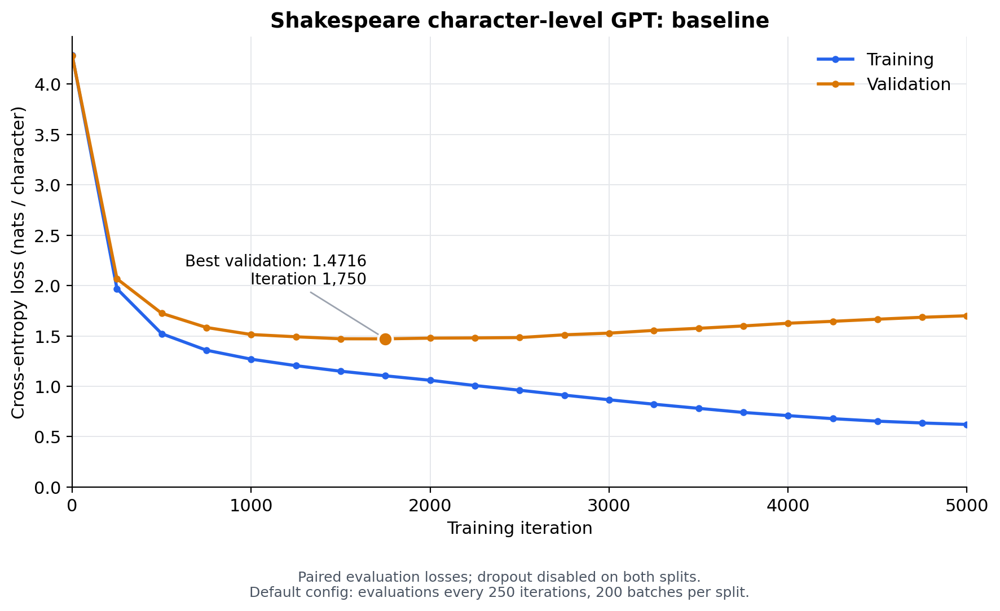

# Shakespeare character-level language model: baseline

Trained from scratch using the README GPU quick start and the default
`config/train_shakespeare_char.py`. The run artifacts and best checkpoint are stored under
`Mini-LLM Exercise/results/shakespeare_char_baseline_20261004`.

The dataset contains 1,003,854 training characters and 111,540 validation characters,
with a vocabulary of 65 characters. The model has 6 Transformer layers, 6 attention
heads, embedding dimension 384, context length 256, and about 10.65 million
non-positional parameters. The default batch size is 64, dropout is 0.2, and the
learning rate decays from 0.001 to 0.0001 after a 100-iteration warmup.
The run used seed 1337, an RTX 4090, CUDA bfloat16, and compilation enabled (`compile=True`).

Training completed through iteration 5,000 (`max_iters=5000`). The stock loop
includes iteration zero. Both losses were evaluated every 250 iterations by
averaging 200 batches per split with dropout disabled, yielding 21 paired points.
Losses are mean cross-entropy in nats per character. The CSV and plot retain the
four-decimal precision printed by the training script.



| Evaluation | Iteration | Training loss | Validation loss |
|---|---:|---:|---:|
| Initial | 0 | 4.2874 | 4.2823 |
| Best validation | 1,750 | 1.1045 | 1.4716 |
| Final | 5,000 | 0.6217 | 1.7005 |

Training loss decreases throughout the run. Validation loss reaches its minimum
around iteration 1,750, then rises while training loss continues
to fall. This divergence indicates overfitting on the small Shakespeare dataset.
The best checkpoint is saved at iteration 1,750, rather than the final iteration,
as specified by the default configuration's validation-based checkpoint selection.

## Reproduce the baseline

Run from `nanoGPT-master`. Quote paths containing spaces.

```bash
python3 data/shakespeare_char/prepare.py
set -o pipefail
python3 -u -B train.py config/train_shakespeare_char.py '--out_dir=Mini-LLM Exercise/results/shakespeare_char_baseline_20261004/checkpoint' 2>&1 | tee "Mini-LLM Exercise/results/shakespeare_char_baseline_20261004/train.log"
python3 -B 'Mini-LLM Exercise/plot_training_loss.py' 'Mini-LLM Exercise/results/shakespeare_char_baseline_20261004/train.log'
```

The original training log and checkpoint retain the paths recorded during training.
Current artifact locations and reproduction commands are recorded in `run_metadata.json`.

## Artifacts

- [Loss plot (PNG)](loss_curve.png) and [PDF](loss_curve.pdf)
- [All evaluation losses (CSV)](losses.csv)
- [Training log](train.log) and [data preparation log](prepare.log)
- [Best checkpoint](checkpoint/ckpt.pt)
- [Original training config](training_config.py) and [run metadata](run_metadata.json)
- [Plotting script](../../plot_training_loss.py)
