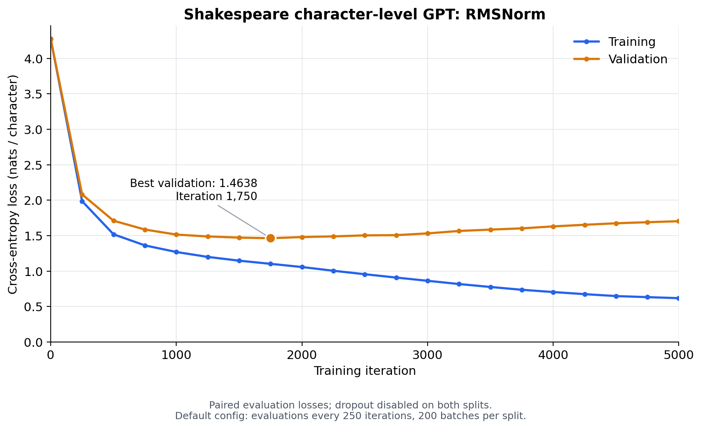

# RMSNorm Shakespeare run

Completed the default training configuration with `--norm_type=rmsnorm`, using
pre-norm placement and epsilon `1e-5`. All 13 normalization layers use RMSNorm.

- Best validation loss: **1.4638** at iteration **1,750**.
- Final training / validation loss: **0.6182 / 1.7037** at iteration **5,000**.
- [Full comparison report](../layernorm_vs_rmsnorm_20261004/README.md)
- [Loss plot](loss_curve.png), [PDF](loss_curve.pdf), [CSV](losses.csv), and [training log](train.log)
- [Run metadata](run_metadata.json) and [best checkpoint](checkpoint/ckpt.pt)
- Source snapshots: [model](source/model.py), [trainer](source/train.py), and [configurator](source/configurator.py)

